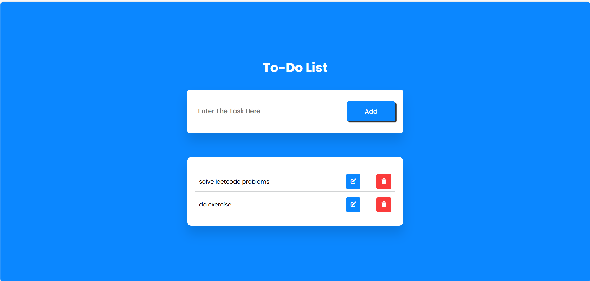

# To-Do List App
## Dive into the project
<em>(Tap on to-do icon to view the project)</em>

## Overview:
A simple and responsive to-do list application built using HTML, CSS, and JavaScript. This app allows users to add, edit, complete, and delete tasks, with data stored in the browser's local storage. It provides a user-friendly interface to manage tasks efficiently.

## Features:
- **Add Tasks:** Enter and add new tasks to your to-do list.
- **Edit Tasks:** Modify existing tasks easily.
- **Mark as Completed:** Click on tasks to mark them as completed.
- **Delete Tasks:** Remove tasks from your list with a simple click.
- **Data Persistence:** All tasks are saved in local storage, ensuring data is preserved across sessions.
- **Responsive Design:** Compatible with various devices and screen sizes.
- **Intuitive Interface:** Easy-to-use interface for managing tasks.

## Technologies Used:
- **HTML:** Structuring the app's interface and elements.
- **CSS:** Styling the layout and visual presentation.
- **JavaScript:** Implementing functionality, handling events, and managing local storage.
  <pre>
  </pre>

## Usage:
1. **Add a Task:**
   - Enter the task description in the input field.
   - Click the "Add" button to add the task to the list.
2. **Edit a Task:**
   - Click the edit button (pencil icon) next to the task you want to edit.
   - Modify the task description in the input field.
   - Click the "Add" button to save the changes.
3. **Complete a Task:**
   - Click on a task to mark it as completed. Completed tasks will have a line-through effect.
4. **Delete a Task:**
   - Click the delete button (trash can icon) next to the task you want to delete.

## Learnings:
Through the To-Do List project, I gained valuable insights into various aspects of web development:

- **DOM Manipulation:** Understanding how to dynamically create, read, update, and delete elements in the DOM.
- **Event Handling:** Learning to attach event listeners to elements and handle different types of events.
- **Local Storage:** Using the browser's local storage to persist data between page reloads.
- **Responsive Design:** Creating a web application that works well on different screen sizes.
- **HTML Structure:** Designing the to-do list interface using HTML to structure elements and create interactive components.
- **CSS Styling:** Applying CSS styles to enhance the visual presentation and user experience.
- **JavaScript Event Handling:** Implementing task interactions and managing data in JavaScript, enhancing understanding of event handling and asynchronous operations.

## Contribution:
Contributions to the project are welcome! Feel free to fork the repository, make improvements, and submit pull requests to suggest new features or enhancements.

## License:
This project is open-source under the [MIT License](LICENSE), allowing for collaboration and distribution.
